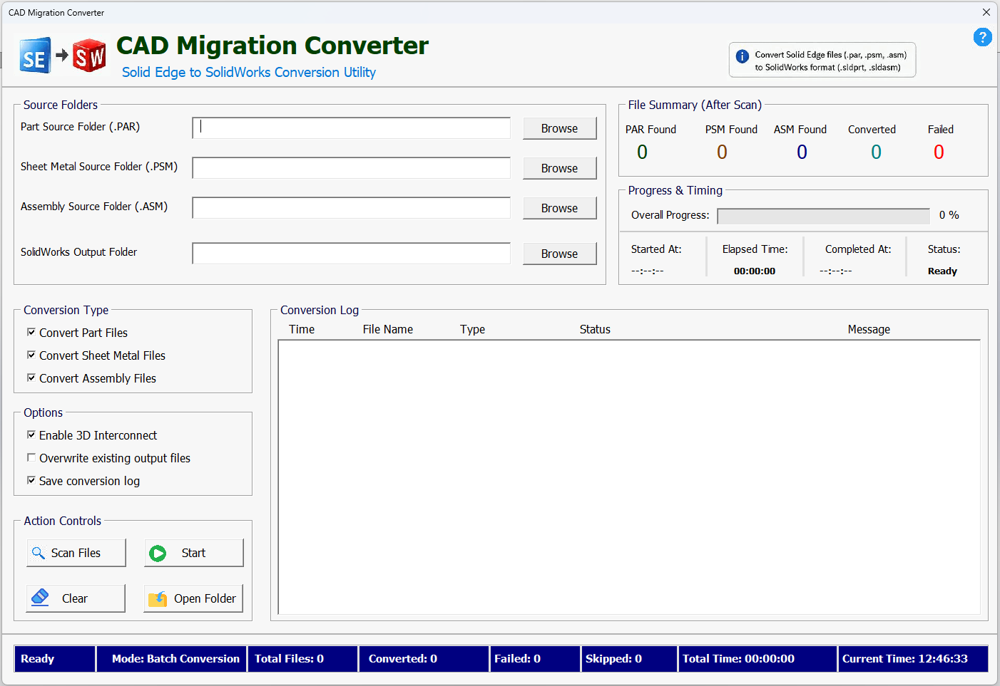
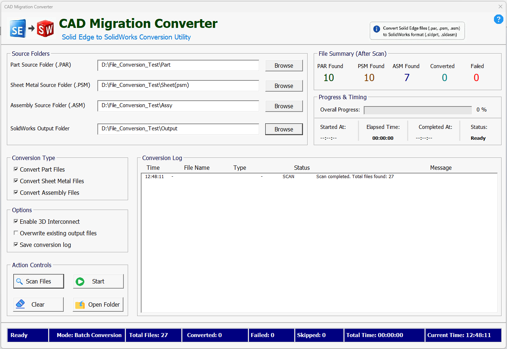
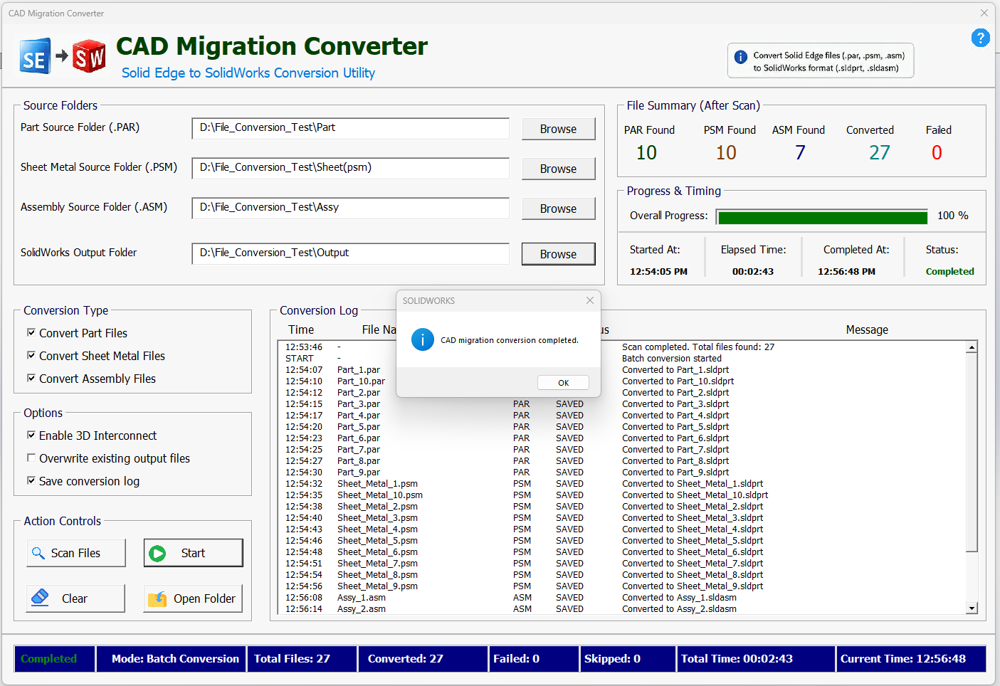
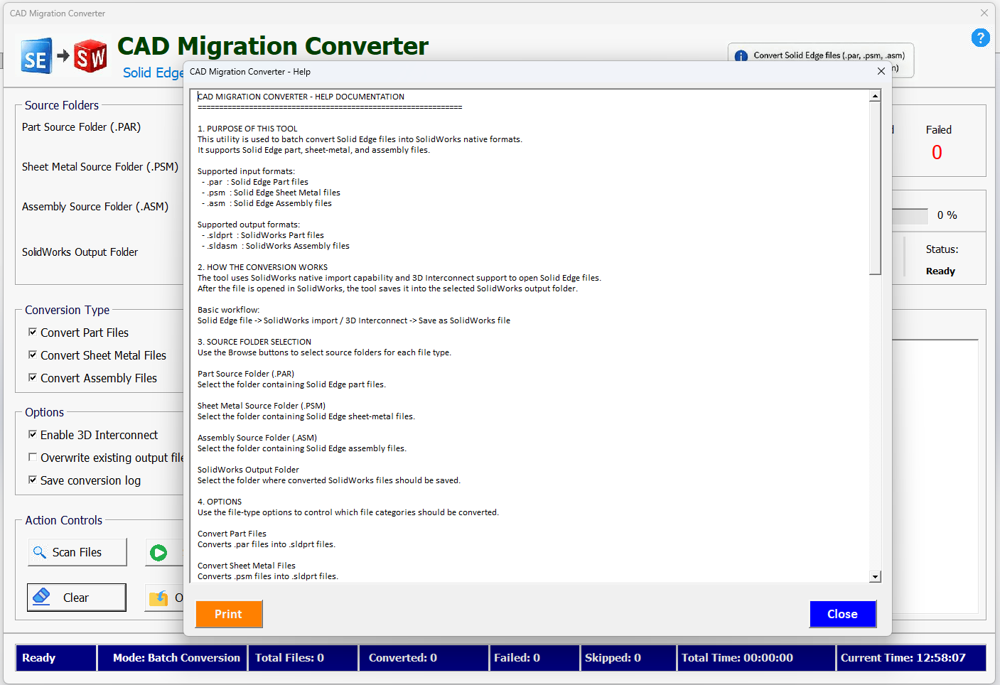

# CAD Migration Converter

CAD Migration Converter is a batch conversion utility developed to convert Solid Edge files into native SOLIDWORKS formats.

The tool supports Solid Edge part, sheet metal, and assembly files and converts them into SOLIDWORKS part and assembly formats using SOLIDWORKS import capability and 3D Interconnect support.

## Supported Input Formats

- `.par` — Solid Edge Part files
- `.psm` — Solid Edge Sheet Metal files
- `.asm` — Solid Edge Assembly files

## Supported Output Formats

- `.sldprt` — SOLIDWORKS Part files
- `.sldasm` — SOLIDWORKS Assembly files

## Key Features

- Batch conversion of Solid Edge files to SOLIDWORKS formats
- Separate source folder selection for part, sheet metal, and assembly files
- SOLIDWORKS output folder selection
- File scanning before conversion
- Conversion progress tracking
- Converted, failed, and skipped file count summary
- Elapsed time and completion time tracking
- Conversion log with file-level status
- Option to overwrite existing output files
- Option to save conversion logs
- Help documentation window for user guidance

## Workflow

1. Select Solid Edge source folders for `.par`, `.psm`, and `.asm` files.
2. Select the SOLIDWORKS output folder.
3. Choose the required conversion types.
4. Enable 3D Interconnect if required.
5. Scan the selected folders.
6. Start batch conversion.
7. Review the conversion log and summary.
8. Open the output folder to verify converted files.

## Screenshots

### Home Screen

### Folder Selection

### Scan Result

### Conversion Completed

### Help Documentation

## Validation Note

This tool is intended to reduce repetitive manual conversion work during CAD platform migration.

After conversion, engineering validation is still recommended to verify:

- Imported solid body quality
- Missing assembly references
- Broken external links
- Sheet metal usability
- Custom property loss
- Drawing link issues
- BOM and part number consistency
- Configuration or revision mismatch
- File naming and folder structure errors

## Disclaimer

This project is shared for learning, portfolio, and CAD automation demonstration purposes.  
No customer files, company data, or confidential production models are included.
